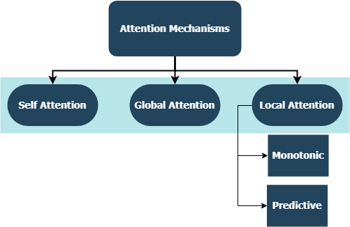
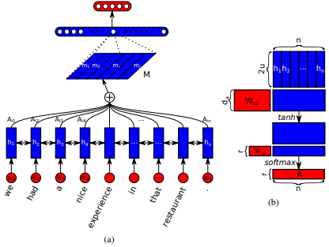
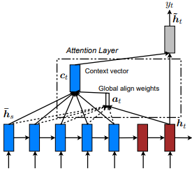
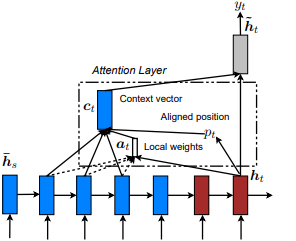
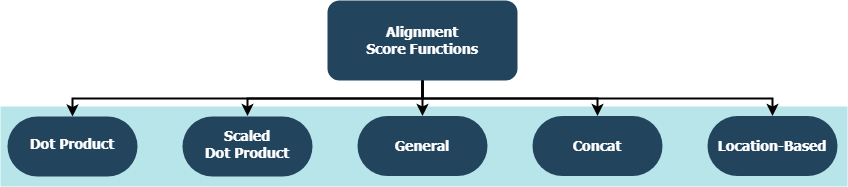

# Introduction to Attention
This repo contains attention mechanism details. Attention mechanism have transformed the landscape of machine translation, and their utilization in other domains of NLP & understanding are increasing day by day. In a broader sense, they aim to eliminate the disadvatageous compression and loss of informations in RNNs. These originate due to fixed length encoding of hidden states derived from input sequences by recurrent layers in seq2seq tasks. Applications include *sentiment analysis, text generation, machine translation, and question answering*.

## Attention Types

<p align="center">

</p>

1. ***Bahdanau Attention***: or called Additive Attention. First introduced in *Neural Machine Translation by Jointly Learning to Align and Translate **(2014)** by Dzmitry Bahdanau et al*. 

The idea is to allow the decoder to dynamically focus on different parts of the input sequence rather than relying on a single fixed-length context vector. At each decoding step, the model computes alignment scores between the current decoder hidden state and each encoder hidden state using a small feedforward neural network. These scores are then normalized to obtain attention weights, which are used to form a context vector as a weighted sum of encoder representations.

This approach helps the model capture long-range dependencies and improves performance on longer sequences by explicitly modeling soft alignments between input and output tokens. The additive formulation provides flexibility in learning complex relationships between encoder and decoder states, making it particularly effective in sequence-to-sequence tasks such as machine translation.

2. ***Luong Attention***: or called Multiplicative Attention. Introduced in *Effective Approaches to Attention-based Neural Machine Translation **(2015)** by Minh-Thang Luong et al*. 

This approach refines the attention mechanism by using simpler and more computationally efficient scoring functions to align encoder and decoder hidden states. Instead of a feedforward network as in Bahdanau attention, Luong attention computes alignment scores using dot-product-based functions between the current decoder hidden state and encoder hidden states.

The computed scores are normalized to produce attention weights, which are then used to generate a context vector as a weighted sum of encoder outputs. Luong attention explores different scoring variants, such as dot, general, and concat, offering a trade-off between simplicity and expressiveness. Compared to additive attention, this method is faster and more efficient while still effectively capturing relevant contextual information, making it well-suited for real-time and large-scale sequence-to-sequence tasks.

3. ***Self Attention***: or called Scaled Dot product attention. Popularized in *Attention Is All You Need **(2017)** by Ashish Vaswani et al*. 

Self-attention is a mechanism that allows a sequence to relate different positions within itself in order to compute richer representations. Instead of relying on recurrent structures, each element in the input sequence attends to all other elements, enabling the model to capture both local and global dependencies efficiently.

At its core, self-attention computes interactions between queries, keys, and values derived from the same input sequence. The attention scores are obtained using scaled dot-product operations, normalized to produce weights, and used to aggregate information across the sequence. This design allows for parallel computation and significantly improves the modeling of long-range relationships.

This approach forms the foundation of Transformer architectures and is often extended using multi-head attention, where multiple attention mechanisms operate in parallel to capture different aspects of the sequence. Self-attention has become a key component in modern natural language processing tasks due to its scalability and effectiveness.

<p align="center">

</p>

### Global (Soft) Attention
First introduced in *Neural Machine Translation by Jointly Learning to Align and Translate* by Dzmitry Bahdanau et al. The idea is to derive a context vector based on **all** hidden states of the encoder RNN. Hence, it is said that this type of attention **attends** to the entire input state space.

<p align="center">

</p>

### Local (Hard) Attention
First introduced in *Show, Attend and Tell: Neural Image Caption Generation with Visual Attention* by Kelvin Xu et al. and adapted to NLP in *Effective Approaches to Attention-based Neural Machine Translation* by Minh-Thang Luong et al. The idea is to  eliminate the attentive cost of global attention by instead focusing on a small subset of tokens in hidden states set derived from the input sequence. This window is proposed as ```[p_t-D, p_t+D]``` where ```D=width```, and we disregard positions that cross sequence boundaries. The aligned position, ```p_t```, is decided either through **a) monotonic alignment:** set ```p_t=t```, or **b) predictive alignment**: set ```p_t = S*sigmoid(FC1(tanh(FC2(h_t)))``` where fully-connected layers are trainable weight matrices. Since yielding an integer index value is undifferentiable due to ```tf.cast()``` and similar methods, this implementation instead derives a aligned position float value and uses Gaussian distribution to adjust the attention weights of all source hidden states instead of slicing the actual window. We also propose an experimental alignment type, **c) completely predictive alignment:** set ```p_t``` as in ii), but apply it to all source hidden states (```h_s```) instead of the target hidden state (```h_t```). Then, choose top ```@window_width``` positions to build the context vector and zero out the rest. Currently, this option is only avaiable for many-to-one scenarios.

<p align="center">

</p>

### Hierarchical Attention
First introduced in *Hierarchical Attention Networks for Document Classification* by Zichao Yang et al.  The idea is to reflect the hierarchical structure that exists within documents. The original paper proposes a **bottom-up** approach by applying attention mechanisms sequentially at word- and sentence-levels, but a **top-down** approach (ex. word- and character-levels) is also applicable. Hence, this type of mechanisms is said to attend differentially to more and less important content when constructing the document representation.

## Alignment Functions
<p align="center">

</p>

Each function is trying to compute an alignment score given a target hidden state (```h_t```) and source hidden states (```h_s```).

| Name | Formula for  | Defined by |
| ------- | --- | --- |
| Dot Product |  | Luong et al. (2015) |
| Scaled Dot Product |  | Vaswani et al. (2017) |
| General |  | Luong et al. (2015) |
| Concat |  | Bahdanau et al. (2015) |
| Location |  | Luong et al. (2015) |

where ```H``` is the number of hidden states given by the encoder RNN, and where ```W_a``` and ```v_a``` are trainable weight matrices.
